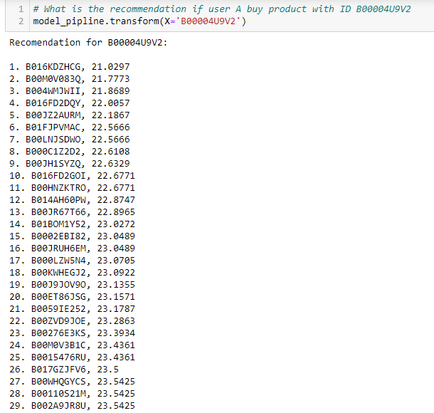
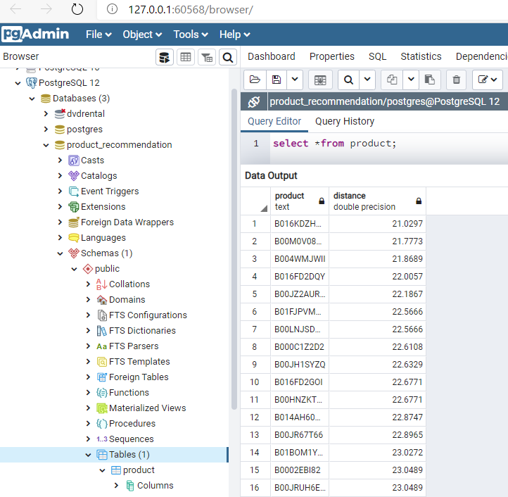

# Product Recommendation using Collaborative Filtering

<b>Product Recoomendation</b> is basically a filtering system that try to predict and show the products that a user would like to purchase. It may not be entirely accurate, but if it shows you what you like. Maybe this recommendation makes you want to buy the product even though you haven't thought about it before. To build the this recommended System, I used collaborative approach (you can try other approach like content based filtering, etc). How collaborative filtering works is filter out products that a user might like based on the basis of reactions by similar users. Below is the example of product review, how this data can be recommended system?

| user\Product | Product 1 | Product 2 | Product 3 | Product 4 |
| :---: | :---: | :---: | :---: | :---: | 
| `User 1` | 5 | 4 | 5 | 2 |
| `User 2` | 2 | 3 |   |   | 
| `User 3` | 4 | 1 | 2 | 5 |
| `User 4` | 5 | 5 |   |   |

 We can see that <i>the character user 4 is very similar with user 1</i>, where both of them like product 1 and 2. In the program, <b><i>we can find the similar user by finding the closest distance between user A and other users using NearestNeighbors algorithm</i></b>. Data that is closest to user A can be said to have the same characteristics, and it is the result. So we can recommend the user 4 product 3, because the characteristic of user 4 is similar with user 1.

## Requirements

* json and gzip (load the file)
* pandas (data preprocessing)
* Matplotlib and seaborn (visualization)
* scipy.sparse (make csr_matrix)
* sklearn.neighbors (clustering algorithm)
* sklearn.pipeline (build the pipeline)
* sklearn.base import BaseEstimator, TransformerMixin (custom transformer in the pipeline)
* sqlalchemy (connecting python with postgres)

## Technical Approach

<ol>
  <li>Load the dataset.</li>
  <li>Choose relevant features from the dataset, you can also remove the duplicate values and perform exploratory data analysis.</li>
  <li>Count the number of reviews for each product and then exclude the products where the number of reviews is less than the threshold value.</li>
  <li>Make a pivot table where the column is reviewer_id, the row is product_id, and the value is rating.</li>
  <li>Sparse the pivot table (make csr_matrix), so the data can be modeled.</li>
  <li>Build NearestNeighbors model and then train the data. In this step you can use <i>euclidean or cosin metric</i> to calculate the product similarity.</li>
  <li>Get the products recommendation using "model.kneighbors". You can determine how meny products recommendation do you want to get from the model.</li>
  <li>Make custom pipeline using custom Transformers.</li>
  <li>The last step, save the recommendation data into Postgres using sqlalchemy.</li>
</ol>

## Here are the results

<b>Jupyter Notebook Result</b>

<b>PostgreSQL Result</b>

##

🎉🎉 Congrats... Now, this is your turn to start build your own Product Recommendation System. <b><i>Happy coding guys :)</i></b>
